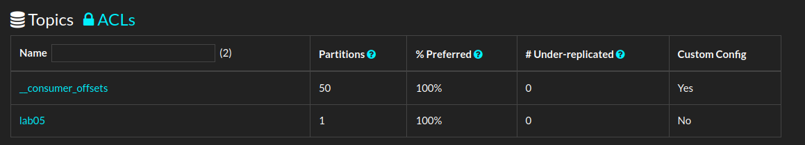
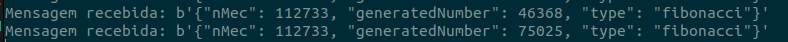

### Lab 5 Event-Driven and Message Queue with Apache Kafka

## 5.1 Configuring Apache Kafka with Docker

**Creating a topic:** After downloading the latest Kafka release and setting up the `docker-compose.yml` i was able to create a topic [a category of messages] using:

```bash
$ docker exec lab05-kafka-1 kafka-topics --create --topic lab05 --partitions 1 --replication-factor 1 --bootstrap-server kafka:9092
```

Then, by opening `http://localhost:9009/`:



**Creating a consumer:** Running the command:

```bash
$ docker exec lab05-kafka-1 kafka-console-consumer --topic lab05 --from-beginning --bootstrap-server kafka:9092
```

**Question f.** What happens if you open multiple consumer terminals? And if you open multiple terminals with
producers? What happens with old messages? Explain it.

- If I open multiple consumers, the messages are distributed among them, but a new consumer won't access messages that have already been consumed. With multiple producers, they can all send messages to the topic without affecting message delivery.

---

## 5.2 Creating a producer and consumer

Created the **consumer** and **producer** for the Kafka topic `lab05_112733`

- The **producer** generates and sends Fibonacci numbers up to a given value of my nMec(112733). Each message follows the correct format:

```json
{'nMec': '112733', 'generatedNumber': <number>, 'type': 'fibonacci'}.
```

The consumer listens to the topic lab05 and reads all messages from the beginning, processing each one as it arrives.


_Last two messages_

**Question .c** The consumer should read all the messages from the topic. What is the last message?

- The last message is the most recent message that has been published to the Kafka topic.

**Question .d** If you run the consumer multiple times, does it read all the messages? Why?

- No, if I run the consumer multiple times, it will not read all the messages that were previously sent to the topic. This happens because Kafka uses offsets to keep track of which messages a consumer has already processed. Once a message is consumed, its offset is committed. When you restart the consumer, it resumes reading from the last committed offset, meaning it won't re-read the messages that were already processed.
